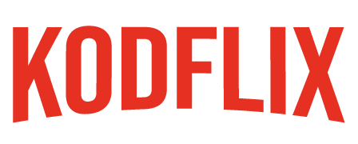

# Kodflix



This is a rebuild of the **Kodflix** project from the Kodiri Bootcamp.

Kodflix is a React-based web application for browsing and viewing TV shows, originally designed as a learning project for mastering modern front-end and full-stack development concepts.

---

## Features

- Responsive gallery of TV show covers
- Hover overlays with animated show titles
- Details page for each show (with cover, title, and synopsis)
- Routing and navigation (React Router)
- 404 Not Found page for invalid show URLs
- Component-based architecture (Gallery, Show, Menu, etc.)
- Data fetched from a backend API (Express.js)
- Loading indicators while fetching data
- Backend connected to a database (e.g., MongoDB)
- Production-ready build and deployment scripts
- Analytics integration (optional)
- Modern CSS styling

---

## Getting Started

### Prerequisites

- Node.js (v18+ recommended)
- npm

### Installation

```sh
git clone https://github.com/st4977f/kodflix.git
cd kodflix
npm install
```